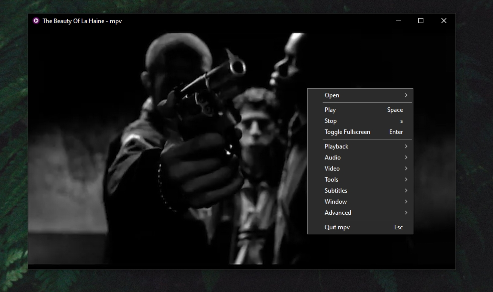

# hellio's mpv config

This repository hosts my personal mpv configuration alongside the scripts I use, making this config very easy to deploy. It is mainly written for GNU/Linux, however I also maintain it for Windows compatibility.

## Requirements

- mpv (version >0.38)
- ffmpeg
- yt-dlp
- wl-clipboard (if using Wayland on GNU/Linux)
- Noto Sans font family (default font used for subtitles)

On Windows, I advise installing the packages via Chocolatey. Otherwise use your preferred package manager on GNU/Linux.

## General outline

This configuration is keyboard-centric, therefore I highly advise you check `input.conf` and edit the keybinds if you feel inclined to do so. You can refer to the keybinds at any time in mpv with the shortcut `Ctrl+h`.

As this is made for mpv version 0.38 which adds the context menu on Windows, the keybindings also include appropriate context menu entries as displayed in the screenshot.

Note about the clipboard on GNU/Linux: by default `script-opts/SmartCopyPaste.conf` is configured to use Wayland's wl-clipboard. Refer to the commented lines above `linux_copz/linux_paste` for the X11 equivalents and adjust the configuration file to match your display server. On Windows the clipboards should work out of the box as the script relies on Powershell.

## Used scripts

Below are links to the scripts used in this configuration:

- [mpv-menu-plugin](https://github.com/tsl0922/mpv-menu-plugin) by [tsl0922](https://github.com/tsl0922)

- [mpv-scripts "encode" and "crop"](https://github.com/occivink/mpv-scripts) by [occivink](https://github.com/occivink)

- [mpv-youtube-download](https://github.com/cvzi/mpv-youtube-download) by [cvzi](https://github.com/cvzi)

- [mpv_geometry_freezer.lua](https://gist.github.com/TheAMM/5e07ad787dd95d76131b61840f403a79) by [TheAMM](https://github.com/TheAMM)

- [delete_file](https://github.com/zenyd/mpv-scripts/blob/master/delete_file.lua) by [zenyd](https://github.com/zenyd)

- [clean-playlist](https://github.com/samhippo/mpv-scripts/blob/master/clean-playlist.lua) by [samhippo](https://github.com/samhippo)

- [mpv-webm](https://github.com/ekisu/mpv-webm) by [ekisu](https://github.com/ekisu)

- [SmartCopyPaste](https://github.com/Eisa01/mpv-scripts) by [Eisa01](https://github.com/Eisa01)
